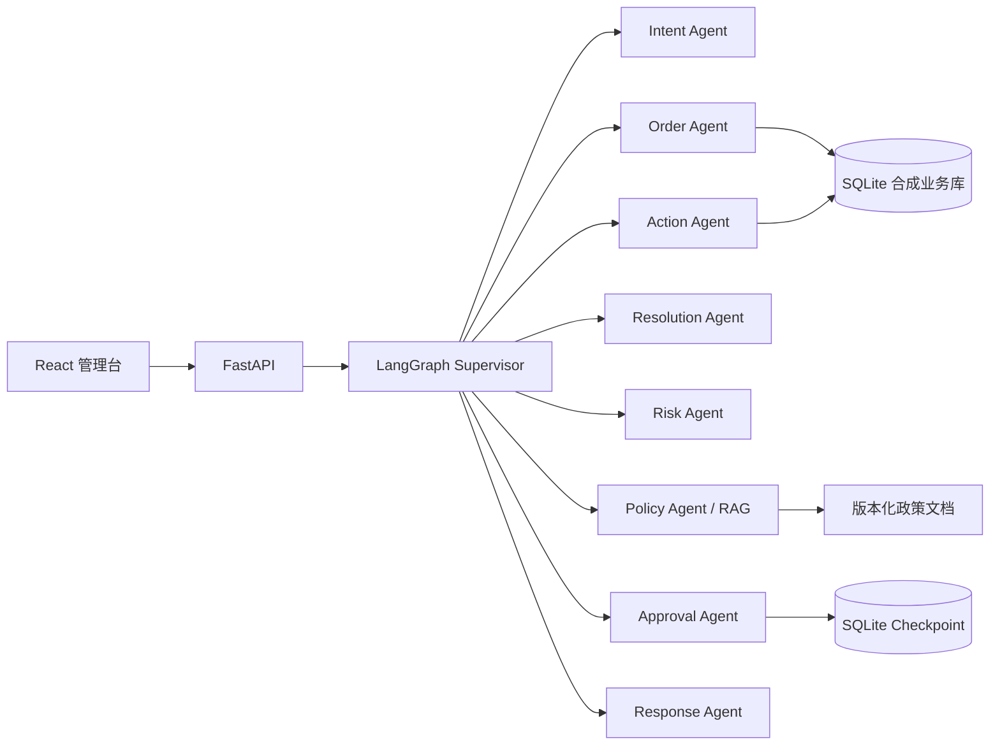

# ServicePilot
智能售后agent早期demo，目前已迭代很多版，已废除8-agent合并为双agent


一个面向电商售后的多智能体 AI 应用 Demo：用 LangGraph Supervisor 编排意图识别、订单核验、政策检索、方案生成、风险判断、人工审批、业务执行和客户回复，并通过 FastAPI 与 React 提供可交互界面。

> 当前定位：学习、作品集与 PoC 演示。项目默认使用合成数据和确定性 Mock 模式，不需要模型 API Key，也不会产生模型调用费用。

## 项目亮点

- **Supervisor 多智能体编排**：8 个职责隔离的 Agent 共享类型化状态，由 Supervisor 显式调度。
- **有边界的业务自动化**：订单归属、退款金额、政策有效期和高风险关键词均由确定性规则校验。
- **Human-in-the-loop**：退款、补偿及其他业务写操作可暂停并等待人工审批，随后从 checkpoint 恢复。
- **本地 RAG**：从版本化 Markdown 政策库检索证据，默认使用本地哈希向量，无需 Embedding API。
- **全链路审计**：保存路由、审批、执行结果和审计事件，便于追踪一次售后请求的完整过程。
- **可复现评测**：提供 50 条离线用例、pytest 测试、GitHub Actions 与 Docker 构建。

## 典型流程

用户提交订单号、邮箱和售后问题后，系统会完成：

1. 识别退款、物流、保修、投诉等意图；
2. 校验客户身份与订单归属；
3. 检索当前有效的售后政策并返回证据；
4. 生成候选解决方案并进行风险判断；
5. 对需要审批的写操作暂停工作流；
6. 审批通过后执行受控业务动作并记录审计日志；
7. 生成最终客户回复。

## 系统架构



## 技术栈

| 层级 | 技术 |
| --- | --- |
| Agent 编排 | LangGraph、LangChain |
| API | FastAPI、Pydantic、Uvicorn |
| 前端 | React 19、TypeScript、Vite |
| 数据与状态 | SQLite、LangGraph SQLite Checkpoint |
| 检索 | 本地哈希向量、政策元数据过滤 |
| 质量保障 | pytest、离线评测、GitHub Actions |
| 交付 | Docker、Docker Compose |

## 快速开始

### 方式一：Docker（推荐体验方式）

需要 Docker Desktop：

```powershell
Copy-Item .env.example .env
docker compose up --build
```

打开 <http://localhost:8000>。停止服务可运行：

```powershell
docker compose down
```

### 方式二：本地开发

需要 Python 3.13 和 Node.js 24。

后端：

```powershell
python -m venv .venv
.\.venv\Scripts\Activate.ps1
python -m pip install --upgrade pip
python -m pip install -e ".[dev]"
python -m servicepilot.seed
python -m servicepilot.api
```

另开一个终端启动前端：

```powershell
Set-Location frontend
npm ci
npm run dev
```

打开 <http://localhost:5173>。FastAPI 文档位于 <http://localhost:8000/docs>。

如果本机已经有名为 `langchain` 的 Conda 环境，也可以直接使用 `scripts/` 中的 PowerShell 脚本：

```powershell
.\scripts\setup.ps1
.\scripts\start-backend.ps1
```

## 演示数据

项目只包含确定性生成的合成数据。可使用下面这组信息体验完整的退款与审批流程：

| 字段 | 示例值 |
| --- | --- |
| 客户邮箱 | `zhangwei@example.com` |
| 订单号 | `SP-2026-0001` |
| 普通问题 | `这个订单的充电器有问题，我想退款 299 元` |
| 高风险问题 | `再不处理我就找律师并向监管部门投诉` |

## 使用真实模型（可选）

默认 `mock` 模式可以运行完整工作流。若要接入 OpenAI 兼容接口：

```powershell
Copy-Item .env.example .env
```

然后在本地 `.env` 中设置：

```dotenv
SERVICEPILOT_MODEL_MODE=openai_compatible
SERVICEPILOT_MODEL_NAME=your-model-name
SERVICEPILOT_API_KEY=your-api-key
SERVICEPILOT_BASE_URL=https://your-provider.example/v1
```

`.env` 已被 Git 忽略。请勿把真实 API Key 写入源码、前端代码、文档或提交历史。

## API 概览

| 方法 | 路径 | 用途 |
| --- | --- | --- |
| `GET` | `/api/health` | 健康检查与数据表统计 |
| `GET` | `/api/v1/demo` | 获取演示账号与示例问题 |
| `GET` | `/api/v1/config/public` | 获取非敏感运行配置 |
| `POST` | `/api/v1/chat` | 发起或继续售后会话 |
| `POST` | `/api/v1/approvals/{thread_id}` | 审批或拒绝待处理动作 |
| `GET` | `/api/v1/tickets/{ticket_id}/audits` | 查询工单审计事件 |

## 测试与评测

在项目根目录运行：

```powershell
python -m pytest
python -m servicepilot.evaluation
Set-Location frontend
npm run build
```

Windows + Conda 环境也可以执行一键检查：

```powershell
.\scripts\run-checks.ps1
```

仓库中的最新记录为：Python 测试 `12 passed`，固定离线评测集 `50/50 passed`，前端生产构建通过。固定样本上的结果只用于回归验证，不代表生产环境准确率。

## 项目结构

```text
ServicePilot/
├─ src/servicepilot/
│  ├─ agents/                  # 8 个专业 Agent
│  ├─ workflow.py              # Supervisor 状态图
│  ├─ service.py               # 工作流门面与恢复逻辑
│  ├─ api.py                   # FastAPI 接口
│  ├─ database.py              # SQLite Repository
│  ├─ retrieval.py             # 本地 RAG 与版本过滤
│  ├─ business_rules.py        # 可配置业务规则
│  └─ evaluation.py            # 离线评测器
├─ frontend/                   # React + TypeScript 管理台
├─ data/policies/              # 合成政策文档
├─ config/business_rules.json  # 审批、风险、检索与数据参数
├─ evals/cases.jsonl           # 50 条回归样本
├─ tests/                      # 单元与集成测试
├─ docs/                       # 使用、架构、调参与学习文档
├─ scripts/                    # Windows 安装、启动与检查脚本
├─ Dockerfile
└─ docker-compose.yml
```

## 文档

- [使用指南](docs/使用指南.md)
- [架构设计](docs/架构设计.md)
- [模块学习指南](docs/模块学习指南.md)
- [参数调试指南](docs/参数调试指南.md)
- [评测指南](docs/评测指南.md)
- [开发与扩展指南](docs/开发与扩展指南.md)
- [生产化差距清单](docs/生产化差距清单.md)
- [需求与技术决策](docs/需求与技术决策.md)

## 安全边界

所有客户、订单、商品和政策均为合成数据。本项目尚未实现生产系统所需的身份认证、RBAC、限流、真实支付适配、隐私合规、幂等控制和完整安全测试，请勿直接用于处理真实客户或真实退款。

## 许可证

项目代码采用 [MIT License](LICENSE)。第三方参考与说明见 [THIRD_PARTY_NOTICES.md](THIRD_PARTY_NOTICES.md)。
