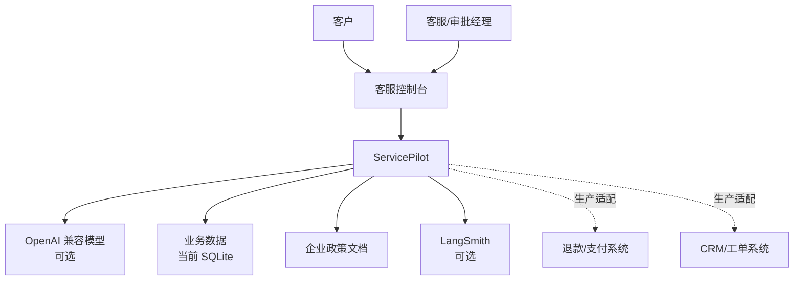
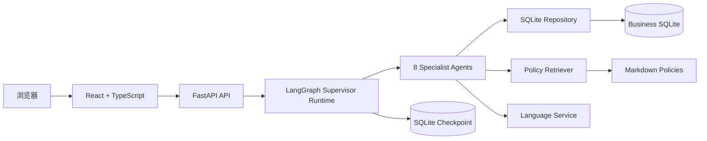
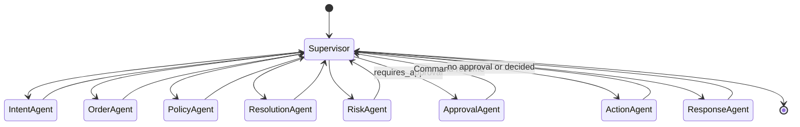
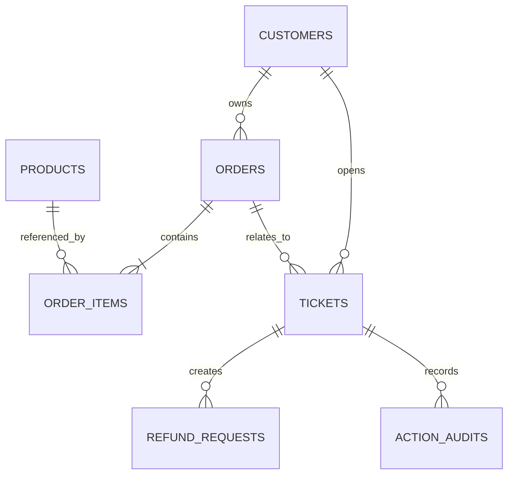
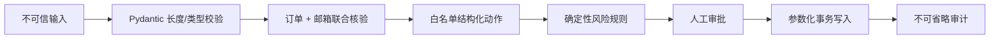
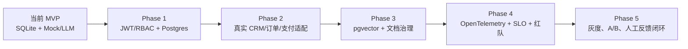

# ServicePilot 架构设计

## 1. 目标

ServicePilot 不是通用聊天机器人，而是受控的售后决策与执行工作流。架构目标：

- 本地无 Key 可运行；
- 多 Agent 分工但流程可预测；
- 任何资金或高风险操作可暂停、审核和恢复；
- 数据、政策和回答有可追溯证据；
- 从 Demo 平滑升级到企业集成，而不假装当前已是生产系统。

## 2. 系统上下文

## 3. 容器视图

开发时 React 和 FastAPI 分端口；生产构建中 React dist 由 FastAPI 同源托管。Docker 使用多阶段构建，最终镜像不包含 Node 开发服务器。

## 4. Agent 组件

| Agent | 输入 | 输出 | 工具/权限 |
|---|---|---|---|
| Intent | 用户消息 | intent、初始风险、标识符 | 模型/规则、客户只读查询 |
| Order | 邮箱、订单号 | 已核验订单或标准错误 | 参数化只读 SQL |
| Policy | intent、问题、区域 | 带来源 evidence | 当前版本政策检索 |
| Resolution | 订单、证据、问题 | 白名单结构化动作 | 无直接副作用 |
| Risk | 动作、金额、风险 | 审批条件与原因 | 外置业务规则、工单状态 |
| Approval | 风险 payload | 人工决策 | interrupt/resume、审计 |
| Action | 动作、人工决策 | 执行结果 | 受控数据库写入 |
| Response | 全部已验证事实 | 客服回复 | Mock 或 LLM |

## 5. 状态机

Supervisor 每次只决定一个下一节点。`completed_agents` 防止重复调度；每次新工单由 Intent Agent 重置本轮字段。

## 6. 数据模型

业务表约束：

- 外键开启；
- 金额非负；
- 邮箱唯一；
- 同一订单同一商品唯一；
- Repository 事务成功才 commit，异常 rollback。

checkpoint 单独存放，避免 LangGraph 内部表与业务表混用。

## 7. 安全控制链

LLM 不拥有 SQL 工具、任意代码执行或支付凭证。即使 Prompt Injection 成功诱导模型，Action Agent 仍只处理已定义动作。

## 8. RAG 设计

索引单位是政策文档。当前文档较短，因此没有复杂 chunking；生产长文档应按章节切块并保留 parent document ID。

检索同时考虑：

- 用户问题；
- intent 对应的领域提示词；
- 向量相似度；
- `status=active`；
- `effective_date <= today`；
- `region` 适配。

Evidence 进入状态而不是只拼进 Prompt，因此 API、UI、审计和评测都能读取同一证据结构。

## 9. 持久化与恢复

本地：

- 业务数据：`data/servicepilot.db`
- 图 checkpoint：`data/checkpoints.db`

每次 invoke 都必须携带 `configurable.thread_id`。前端把 thread_id 保存在 React 状态中；审批 API 路径也使用它。

本地 SQLite checkpoint 支持单实例重启恢复，但不支持真正的多副本横向扩容。生产替换 Postgres checkpointer 后，
API 节点可以无状态化，负载均衡后的另一个实例也能恢复同一线程。

## 10. 可观测性

本地始终可用：

- `route_log`：Agent 调度顺序；
- `action_audits`：分类、审批、执行、回复证据；
- evaluation report：路由和证据指标；
- API health：数据表数量和模型模式。

可选 LangSmith：

- graph run name；
- ticket_id metadata；
- supervisor/HITL tags；
- 模型调用、耗时和错误链路。

生产还应接入 OpenTelemetry、集中日志、指标告警和敏感字段脱敏。

## 11. 关键架构取舍

### 程序化 Supervisor vs LLM Supervisor

选择程序化：路径稳定、成本低、可测试、不跳过风控。代价是新增流程需要改代码。对于流程型售后系统，这是合理取舍。

### SQLite vs 外部数据库

选择 SQLite：用户没有数据库也能运行，方便 CI 和现场演示。代价是并发和扩展性有限。Repository 边界让未来迁移 Postgres 更集中。

### 本地哈希 Embedding vs 语义模型

选择本地哈希：零下载、零 Key、确定性。代价是泛化弱。评测框架让替换 Embedding 后能量化比较，而不是凭感觉选模型。

### FastAPI 托管静态 React

选择单容器：部署简单，适合作品集和 FDE PoC。大规模生产可拆 CDN 前端和独立 API，不影响业务图。

## 12. 失败与恢复策略

| 故障 | 当前行为 | 生产增强 |
|---|---|---|
| 模型超时 | 最多重试 2 次，API 返回错误 | 熔断、fallback 模型、队列 |
| 身份不匹配 | 返回统一隐私提示 | 接入 OAuth/OTP |
| 审批期间重启 | SQLite checkpoint 恢复 | Postgres checkpoint |
| 业务写入异常 | 事务 rollback | 幂等键、outbox、补偿事务 |
| 政策无结果 | 回复要求补充/转人工 | 内容运营告警 |
| LangSmith 不可用 | 本地流程不依赖它 | 异步观测上报 |

## 13. 生产演进路线

这条路线体现“先证明业务闭环，再增加基础设施”，比一次性堆 Kafka、Kubernetes、Neo4j 更适合当前项目阶段。
