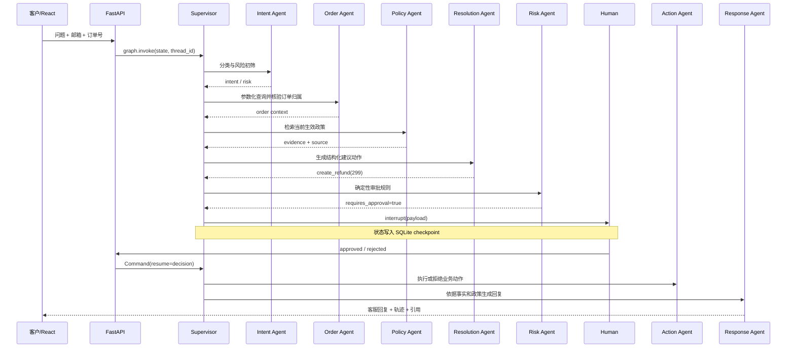

# ServicePilot 模块学习指南

这份文档不是只告诉你“代码在哪里”，而是解释每个模块为什么这样设计、运行时发生什么，以及面试时如何讲清楚。

## 1. 先建立整体心智模型

一次退款请求不会直接交给一个万能 Agent，而是经过以下流水线：



核心思想：**LLM 负责不确定的语言任务，代码负责确定的业务约束和副作用。**

## 2. 建议学习顺序

1. `schemas.py`：先看 Agent 共同读写什么。
2. `workflow.py`：理解 Supervisor 如何决定下一个 Agent。
3. `agents/`：逐个理解职责和工具边界。
4. `service.py`：理解 invoke、thread_id、checkpoint 与 resume。
5. `database.py`：理解业务数据和安全查询。
6. `retrieval.py`：理解文档元数据、Embedding、检索和版本过滤。
7. `llm.py`：理解 Mock/真实模型切换和硬规则兜底。
8. `api.py` 与 `frontend/`：理解交付层。
9. `evaluation.py`、`evals/`、`tests/`：理解如何证明系统行为。

## 3. 状态层：`schemas.py`

`SupportState` 是所有 Agent 之间的契约。它不是随手拼出的字典，而是 TypedDict：

- `messages`：使用 LangGraph 的 `add_messages` reducer，支持多轮消息追加和消息 ID 合并；
- `ticket_id`：业务工单 ID；
- `customer_email`、`order_id`：调用方输入；
- `customer`、`order`：订单 Agent 核验后才能产生；
- `intent`、`risk_level`：意图 Agent 输出；
- `evidence`：政策 Agent 返回的带来源证据；
- `proposed_action`：方案 Agent 输出的结构化动作，不是自然语言命令；
- `requires_approval`、`approval`：风险和人工决策；
- `action_result`：动作 Agent 的真实执行结果；
- `route_log`、`completed_agents`：Supervisor 路由依据和可观测轨迹。

为什么共享状态适合这个项目？因为每个 Agent 都需要消费上一阶段的结构化结果。相比把完整对话复制给所有 Agent，
共享状态更节省 Token，也能让风险规则直接读取金额等可靠字段。

## 4. Supervisor：`workflow.py`

Supervisor 使用 `Command(goto=...)` 显式路由。每个专业 Agent 完成后把名称写入 `completed_agents`，然后返回 Supervisor。
Supervisor 根据完成集合和 `requires_approval` 决定下一步。

这不是“让大模型自由选择所有路由”，原因有三点：

1. 退款链路顺序是业务流程，不应由概率模型随意跳过；
2. 显式路由容易测试，可以准确断言审批一定发生在写入之前；
3. 模型故障时，数据库查询和安全规则仍能运行。

这里依然是多 Agent：每个 Agent 有独立职责、输入输出和工具边界，由 Supervisor 协作；只是 Supervisor 采用可靠的程序化策略。
以后可以增加 `supervisor_mode=llm` 做实验，但生产默认不建议让模型绕过必经节点。

## 5. Intent Agent：`agents/intent_agent.py`

职责：

- 读取最近一条 HumanMessage；
- 调用 `LanguageService.classify()`；
- 从消息或表单提取邮箱与订单号；
- 查找客户基本信息；
- 重置本轮临时字段，避免上一轮工单状态污染；
- 写入分类审计事件。

Mock 模式使用可预测的关键词规则。真实模型使用 Pydantic `Classification` 作为 structured output。
高风险词由代码再次判断，因此模型只能提高表达质量，不能把命中的 high 风险降成 low。

练习：新增 `invoice` 意图时，需要同时修改 Intent 类型、分类规则、政策提示、方案逻辑和评测用例。

## 6. Order Agent：`agents/order_agent.py`

Order Agent 只拥有只读数据访问能力。关键安全规则：

```sql
WHERE o.order_id = ? AND lower(c.email) = lower(?)
```

它不是先查订单再比较邮箱，而是在同一个参数化查询中验证归属，因此不会在失败响应里泄露订单信息。

错误使用标准化代码：

- `missing_identity`：需要订单信息但缺少邮箱或订单号；
- `identity_mismatch`：邮箱与订单不匹配，或订单不存在。对外统一回复，防止枚举订单。

注意：示例不提供“执行任意 SQL”的工具。企业 Agent 应优先提供粒度合适、参数固定的业务工具，而不是把数据库权限交给 LLM。

## 7. Policy Agent 与本地 RAG

相关文件：

- `agents/policy_agent.py`
- `retrieval.py`
- `data/policies/*.md`

每份 Markdown 使用 front matter：

```yaml
id: POL-REFUND-001-V2
title: 退货退款政策
version: 2.0
effective_date: 2026-01-01
status: active
region: ALL
```

检索步骤：

1. `parse_policy()` 校验元数据；
2. `LocalHashEmbeddings` 对中文字符、二元字符组和英文词做稳定哈希；
3. LangChain `InMemoryVectorStore` 计算相似度；
4. `is_current()` 过滤 inactive、未来生效和不适用区域的文档；
5. 返回标题、版本、源文件、摘要、分数和生效日期。

为什么默认不用 HuggingFace 大模型？本项目要让没有 GPU、Embedding API 和外部数据库的人也能跑通完整 RAG 生命周期。
哈希 Embedding 适合测试和演示，不代表生产语义质量。生产可替换 BGE-M3、OpenAI Embeddings 和 pgvector，接口不需要改变。

## 8. Resolution Agent

`agents/resolution_agent.py` 把问题转换为结构化建议：

```python
{
    "type": "create_refund",
    "order_id": "SP-2026-0001",
    "amount": 299.0,
    "reason": "..."
}
```

结构化动作很重要：风险 Agent 不需要分析一段含糊自然语言，可以直接判断 `type` 和 `amount`；
Action Agent 也只接受白名单动作，不执行任意代码。

金额使用 `min(requested, paid)`，防止请求金额超过订单实付。真实系统还需要按商品、已退金额、优惠分摊和支付渠道重新计算。

## 9. Risk Agent

`agents/risk_agent.py` 是确定性 Policy-as-Code：

- 所有退款写操作是否审批；
- 超过阈值是否额外提示；
- 所有补偿是否审批；
- high 风险是否审批。

这些参数来自 `config/business_rules.json`，不是写死在 Prompt 中。Prompt 不是可靠权限控制，因为用户输入可能注入、模型可能忽略。

风险 Agent 也会 upsert 工单，把状态更新为 `pending_approval` 或 `processing`。

## 10. Approval Agent：LangGraph HITL

`interrupt(payload)` 发生时：

1. 当前图运行停止；
2. LangGraph 把状态和下一步写入 checkpoint；
3. API 返回 `thread_id` 和审批 payload；
4. 人工提交决定；
5. 服务调用 `Command(resume={...})`；
6. Approval Agent 从同一位置继续执行。

`interrupt()` 恢复时会重新进入节点，因此 interrupt 之前不要放不可重复的副作用。项目把审计决定写入放在 interrupt 返回之后。

checkpoint 使用独立 SQLite 文件，并设置 `check_same_thread=False` 以适配 FastAPI 线程池。本地测试证明重建 ServicePilot 实例后仍可恢复。
生产多副本应替换 Postgres checkpointer，不能让多个容器共享本地 SQLite 文件。

## 11. Action Agent

Action Agent 是副作用边界：

- 审批拒绝：只记录 `rejected_by_human`，不写退款表；
- 退款批准：事务内写 `refund_requests` 并更新工单；
- 高风险升级：写结构化升级结果；
- 所有执行结果进入 `action_audits`。

当前演示还没有真正调用支付网关。真实集成必须增加幂等键，例如 `ticket_id + action_type`，防止网络重试造成重复退款。

## 12. Response Agent 与模型边界

`LanguageService` 隔离模型供应商：

- `mock`：确定性模板，零成本、适合 CI；
- `openai_compatible`：`ChatOpenAI(base_url=..., api_key=...)`，适配多数兼容服务。

回复输入只包含已核验订单、证据、动作、审批和执行结果。系统提示明确禁止：

- 编造订单或政策；
- 身份失败时泄露信息；
- 审批前宣称退款已完成；
- 缺少证据时作确定承诺。

最终回复在末尾引用政策标题、版本和源文件，便于客服与审核人员追踪依据。

## 13. 数据与审计

`database.py` 使用 Python 标准库 `sqlite3`：

- context manager 控制 commit/rollback；
- 所有外部输入用 `?` 参数绑定；
- 外键、CHECK、UNIQUE 和索引保护数据；
- Repository 函数封装业务 SQL；
- `action_audits.details_json` 保存结构化轨迹。

`seed.py` 使用固定随机种子创建 100 客户、20 商品、500 订单。`张伟`和订单 `SP-2026-0001` 是固定演示数据，
保证 README、测试和现场 Demo 可重复。

## 14. FastAPI

`api.py` 的角色是协议适配，不在路由函数里实现业务规则：

- Pydantic 校验请求长度和类型；
- 生成或接收 `thread_id`；
- 将图结果转换为稳定的 `AgentResponse`；
- 提供审批、审计、健康和公开配置接口；
- 开发时允许 React CORS，生产构建时托管 `frontend/dist`。

`get_service()` 使用进程级缓存，因此同一 API 实例共享图和 checkpoint 连接。

## 15. React 前端

前端关键文件：

- `src/api.ts`：后端类型与 fetch 封装；
- `src/App.tsx`：会话、审批和 Agent 观测状态；
- `src/styles.css`：三栏企业控制台布局。

前端不保存 API Key，也不直接访问数据库。待审批时禁用新消息输入，防止同一个线程出现并发歧义。

## 16. 测试与评测的区别

`tests/` 验证代码不变量，例如：

- 不匹配邮箱不能读取订单；
- inactive 政策不会被使用；
- 拒绝退款后退款表仍为 0；
- 批准后只写一次；
- 重建服务仍能恢复审批；
- FastAPI 与 React dist 可访问。

`evals/cases.jsonl` 验证 Agent 质量，例如意图、审批路由和证据召回。测试失败通常是程序 bug；
评测下降可能是模型、Prompt、文档或数据分布变化。

## 17. 推荐动手练习

1. 把退款阈值从 200 改为 500，观察 `approval_reasons`；注意所有写入审批仍会生效。
2. 新增一份未来生效的退款政策，证明它不会进入 evidence。
3. 新增 `invoice_agent`，处理发票抬头与下载链接。
4. 把 `LocalHashEmbeddings` 替换为 BGE，并比较 50 条评测。
5. 给 Action Agent 加幂等键和重复审批测试。
6. 给 API 加 JWT 和 manager/customer 两种角色。
7. 把 SQLite checkpointer 换成 Postgres，并用两个 API 实例验证恢复。

完成这些练习后，你不仅能“讲 LangGraph”，还能解释业务风险、交付边界和工程取舍。

